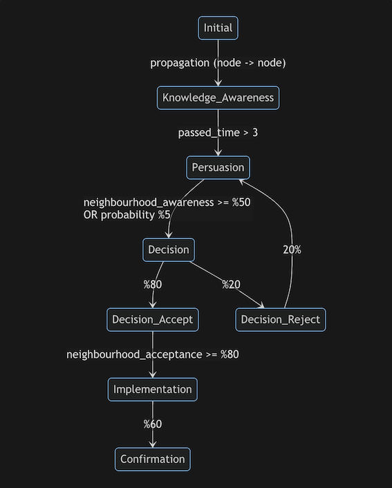

# A Basic Diffusion of Innovation Simulation

## Definition

> Diffusion of innovations is a theory that seeks to explain how, why, and at what rate new ideas and technology spread. Everett Rogers, a professor of communication studies, popularized the theory in his book Diffusion of Innovations; the book was first published in 1962, and is now in its fifth edition (2003). Rogers argues that diffusion is the process by which an innovation is communicated over time among the participants in a social system. The origins of the diffusion of innovations theory are varied and span multiple disciplines. [_Wikipedia_](https://en.wikipedia.org/wiki/Diffusion_of_innovations)

## Adoption process

There are 8 stages (states) for each node. Even though stages are pretty much the same with original theory, conditions are custom for this project. Conditions were designed so that the nodes are exposed to various factors throughout the process.

## Requirements

-   `matplotlib`
-   `networkx`
-   `ffmpeg`
-   `python`

## Output

**Scale-Free network (`alpha=0.98`)**

**Scale-Free network (`alpha=0.50`)**

**Random network (`p=0.05`)**

## License

GNU General Public License v3.0  
Read the LICENSE file for details
